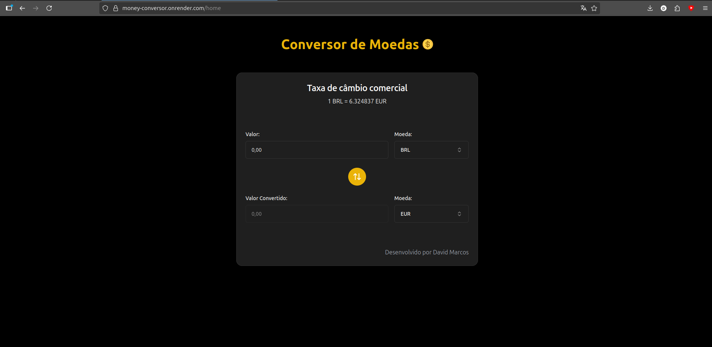

##

<div style="display: flex; align-items: center;">
  <span style="margin-left: 10px; font-size: 24px; font-weight: bold;">Conversor de modedas</span>
</div>
<hr>

Uma aplicação web desenvolvida com React.js, essa aplicação tem como finalidade servir para converter valores monetarios para diversos tipos de moedas.

Acesse o projeto: <a url="https://money-conversor.onrender.com">https://money-conversor.onrender.com</a>



## Arquitetura da Aplicação:

A aplicação é composta apenas pelo front-end do projeto que se conecta com a api externa <a url="https://www.exchangerate-api.com">https://www.exchangerate-api.com</a> para aplicar as converções.

## Tecnologias Utilizadas no Projeto:

Para a criação da arquitetura da aplicação foram utilizados:

- Docker
- Docker Compose

Para o Front-end da aplicação foram utilizados:

- React
- TypeScript
- TailwindCSS
- Shadcn
- Axios

## Rodando o Projeto:

### Dependências:

É necessário ter instalado o Docker e o Docker Compose no seu computador para rodar o projeto.

Para isso, acesse: [Instalar Docker](https://docs.docker.com/engine/install/) e [Instalar Docker Compose](https://docs.docker.com/compose/install/).

### Execultando o projeto:

Por fim dentro da pasta do projeto, abra um terminal e execulte o comando:

```
 docker-compose up --build
```

Se tudo ocorrer bem voce deve ser capaz de acessar aplicação no seu navegador acessando a rota:

```
 http://localhost:5173/
```

### Deploy do projeto

<a url="https://money-conversor.onrender.com">https://money-conversor.onrender.com</a>
